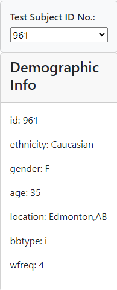

# belly-button-challenge

## Background:
### I built an interactive dashboard to dive into the Bellybutton datasets in my own dashboard. The datasets brought to light that a small amount of microbials or OTUs were in more than 70% of the test subjects while the other 30% were rare. Using the interactive dashboard you can go through the json data to look at individual test subjects by their id number while also seeing the top 10 bacteria strains, and the bacterias by sample. 

## Test Subject #961 Table

## Top 10 Bacteria By Subject Bar Graph

.png>)

## Bacteria By Sample Bubble Chart

.png>)

## Methods Used:
### JavaScript
### HTML
### D3 Library
### Plotly
### CSS